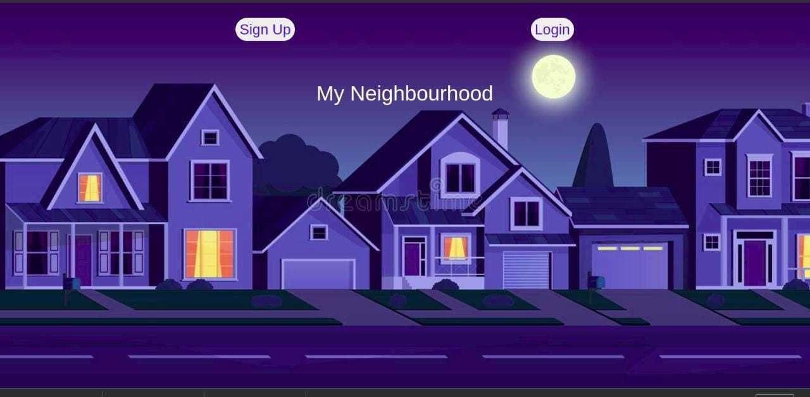
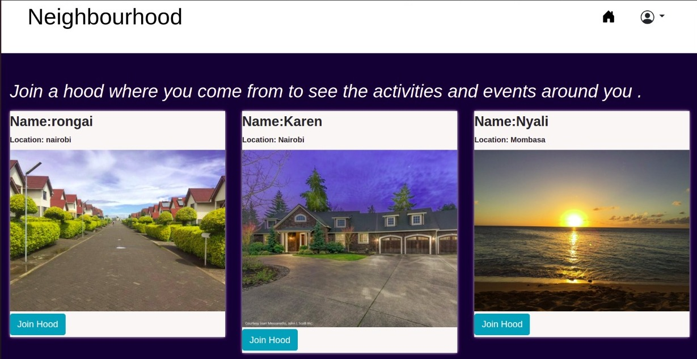
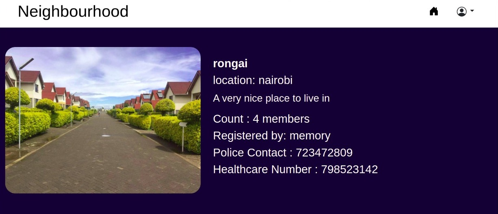
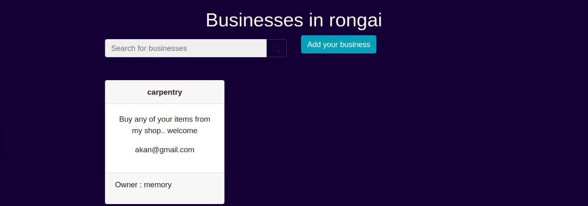

## Neighbourhood

## Author
Memory Wabwile 
https://github.com/Memory-Wabwile

## Description
Neighbourhood is an application that enables users to know what is going on in their neighbourhood after logging in to the site and choosing their location. Users are also able to update others on what's going on and see the available businesses in the neighbourhood.

## Live Site
click on  to view the site

## BDD
1. A user is able to sign up then log in to the application.
2. A user is to set their profile and a general location and a neighbourhood name.
3. A user is able to find a list of different businesses in the neighbourhood.
4. A user is able to find contact information for the health department and police authorities near the neighbourhood.
5. A user is able to create posts that will be visible to everyone in the neighbourhood.
6. A user is able change a neighbourhood when they decide to move out
7. A user is able to view details of a single neighbourhood.

## Design
Landing page design for Neighbourhood app

## Technologies Used
<ul>Python 3.9</ul>

## Known Bugs
Currently there are no known bugs

## Dependancies
pyhton3.9  
Django Bootstrap4 
Python Venv 

## Setup instructions
<ul>
<li>click on  to clone this repository</li> 
<li>open the terminal and type "git clone "</li>  
<li>Navigate into the folder and install requirements using the command
"cd instagram "  then "pip install -r requirements.txt" </li> 
<li>Install and activate Virtual
- "python3 -m venv virtual - source virtual/bin/activate  "</li>
 
<li>Setup Database</li> 
<li>SetUp your database User,Password, Host then make migrations using the command 
"python manage.py makemigrations"</li> 
<li>Now Migrate using the command 
"python manage.py migrate "</li> 
<li>Run the application with 
"python manage.py runserver" </li> 
</ul>

## Contact Information
For any querries email me at memorywabwile@gmail.com

## License
Copyright (c) {2021} *{Wabwile Memory}*

Permission is hereby granted, free of charge, to any person obtaining a copy
of this software and associated documentation files (the "Software"), to deal
in the Software without restriction, including without limitation the rights
to use, copy, modify, merge, publish, distribute, sublicense, and/or sell
copies of the Software, and to permit persons to whom the Software is
furnished to do so, subject to the following conditions:

The above copyright notice and this permission notice shall be included in all
copies or substantial portions of the Software.